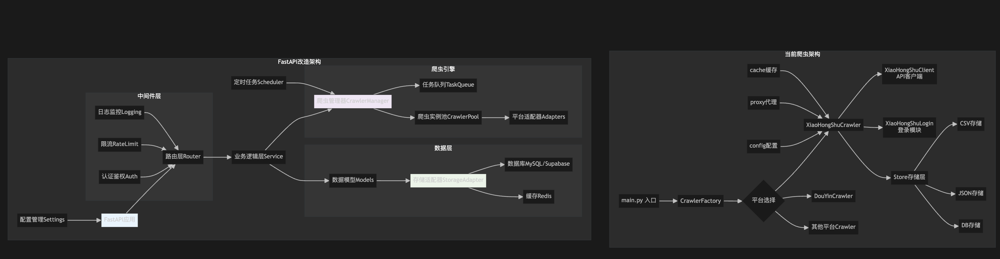

# MediaCrawler API Server

<div align="center">



**基于 FastAPI 的多平台社交媒体数据采集 API 服务**

[](https://www.python.org/downloads/)
[](https://fastapi.tiangolo.com/)
[](LICENSE)

</div>

## 📖 项目简介

MediaCrawler API Server 是一个基于 FastAPI 框架构建的高性能社交媒体数据采集服务，通过适配器模式复用原有的 MediaCrawler 爬虫功能，为开发者提供统一的 RESTful API 接口来采集和管理多平台社交媒体数据。

### 🎯 核心特性

- 🚀 **多平台支持**: 支持小红书、抖音、快手、B站、微博、百度贴吧、知乎等7大主流平台
- 🔧 **统一接口**: 提供标准化的 RESTful API，简化多平台数据采集
- 🛡️ **类型安全**: 基于 Pydantic 模型的完整类型检查和配置验证
- 📊 **多存储支持**: 支持 JSON、CSV、Supabase 等多种数据存储方式
- 🔄 **异步处理**: 基于 FastAPI 的高性能异步处理架构
- 🎛️ **灵活配置**: 支持多层级配置管理，满足不同场景需求
- 📈 **实时监控**: 提供任务状态监控、进度跟踪和日志管理

## 🏗️ 设计思想

### 核心架构原则

#### 1. **适配器模式 (Adapter Pattern)**
```
┌─────────────────┐    ┌──────────────────┐    ┌─────────────────────┐
│   FastAPI API   │ => │  Crawler Adapter │ => │  MediaCrawler Core  │
└─────────────────┘    └──────────────────┘    └─────────────────────┘
```

通过适配器模式封装原有的 MediaCrawler 功能，提供统一的 API 接口，实现新旧系统的无缝集成。

#### 2. **配置统一收口**
```
┌─────────────────────────────────────────────────────────────┐
│                   ConfigManager (统一配置管理)                │
├─────────────────┬─────────────────┬─────────────────────────┤
│   AppConfig     │  CrawlerConfig  │     StorageConfig       │
│   (应用级配置)    │  (爬虫任务配置)   │     (数据存储配置)       │
└─────────────────┴─────────────────┴─────────────────────────┘
```

所有配置统一通过 ConfigManager 管理，基于 Pydantic 模型提供类型安全的配置交互。

#### 3. **模块化分层架构**
```
┌─────────────────────────────────────────────────────────────┐
│                        API Layer                           │
├─────────────────────────────────────────────────────────────┤
│                      Business Layer                        │
│  ┌─────────────────┐  ┌─────────────────┐  ┌──────────────┐ │
│  │ Crawler Adapter │  │  Data Reader    │  │ Login Manager│ │
│  └─────────────────┘  └─────────────────┘  └──────────────┘ │
├─────────────────────────────────────────────────────────────┤
│                        Core Layer                          │
│  ┌─────────────────┐  ┌─────────────────┐  ┌──────────────┐ │
│  │ Config Manager  │  │ Logging Manager │  │Database Utils│ │
│  └─────────────────┘  └─────────────────┘  └──────────────┘ │
├─────────────────────────────────────────────────────────────┤
│                   Integration Layer                        │
│                  MediaCrawler Core                         │
└─────────────────────────────────────────────────────────────┘
```

## 🏗️ 代码框架

### 目录结构
```
MediaCrawler-ApiServer/
├── app/                          # 应用主目录
│   ├── api/                      # API路由层
│   │   ├── data.py              # 数据查询API
│   │   └── login.py             # 登录管理API
│   ├── core/                     # 核心模块
│   │   ├── config_manager.py    # 统一配置管理
│   │   ├── config.py            # 基础配置
│   │   ├── logging.py           # 日志管理
│   │   ├── database.py          # 数据库工具
│   │   └── login_manager.py     # 登录状态管理
│   ├── crawler/                  # 爬虫适配器
│   │   ├── adapter.py           # 主适配器
│   │   └── core/                # 爬虫核心组件
│   ├── dataReader/              # 数据读取器
│   │   ├── base.py              # 基础抽象类
│   │   ├── factory.py           # 工厂模式
│   │   ├── json_reader.py       # JSON数据读取
│   │   ├── csv_reader.py        # CSV数据读取
│   │   └── supabase_reader.py   # Supabase数据读取
│   ├── models/                   # 数据模型
│   │   ├── base.py              # 基础模型
│   │   ├── comment.py           # 评论模型
│   │   ├── content.py           # 内容模型
│   │   └── task.py              # 任务模型
│   └── main.py                   # FastAPI应用入口
├── MediaCrawler/                 # 原MediaCrawler项目
├── data/                         # 数据存储目录
├── logs/                         # 日志文件
├── tests/                        # 测试文件
├── examples/                     # 示例代码
└── config.env.example           # 配置文件模板
```

### 核心模块说明

#### 1. **配置管理模块** (`app/core/config_manager.py`)
```python
# 应用级配置
class AppConfig(BaseModel):
    app_name: str = "MediaCrawler API Server"
    version: str = "1.0.0"
    supported_platforms: List[str]

# 爬虫配置请求（API层）
class CrawlerConfigRequest(BaseModel):
    enable_proxy: Optional[bool] = None
    headless: Optional[bool] = None
    max_retries: Optional[int] = None

# 完整爬虫配置（内部使用）
class CrawlerConfig(BaseModel):
    platform: str
    enable_proxy: bool = False
    headless: bool = True
    max_retries: int = 3

# 存储配置
class StorageConfig(BaseModel):
    source_type: str
    connection_timeout: int = 30
    retry_times: int = 3
```

#### 2. **爬虫适配器** (`app/crawler/adapter.py`)
```python
class MediaCrawlerAdapter:
    async def start_crawler_task(self, task: CrawlerTask)
    async def get_task_status(self, task_id: str)
    async def get_task_result(self, task_id: str)
    async def stop_task(self, task_id: str)
```

#### 3. **数据读取器** (`app/dataReader/`)
```python
class BaseDataReader(ABC):
    @abstractmethod
    async def get_content_list(self, platform, filters)
    @abstractmethod
    async def get_content_by_id(self, platform, content_id)
    @abstractmethod
    async def search_content(self, platform, keyword, filters)
```

## 🔄 模块流程

### 1. 爬虫任务执行流程
```
Client Request → FastAPI → ConfigManager → CrawlerAdapter → MediaCrawler
                                ↓
Response ← JSON Result ← Task Result ← Crawler Execution ← Core Engine
```

### 2. 配置管理流程
```
API Request → CrawlerConfigRequest → ConfigManager.build_crawler_config()
                                           ↓
默认配置 + 平台配置 + 环境变量 + API配置 → CrawlerConfig → 类型验证 → 最终配置
```

### 3. 数据查询流程
```
Data API Request → DataReaderFactory → DataReader → DataSource
                                          ↓
JSON Response ← Formatted Result ← Query Result ← Raw Data
```

## 📡 接口规范

### 1. 爬虫任务管理

#### 创建爬虫任务
```http
POST /api/v1/tasks
Content-Type: application/json

{
  "platform": "xhs",
  "task_type": "search",
  "keywords": ["美食", "旅行"],
  "max_count": 100,
  "max_comments": 50,
  "headless": true,
  "enable_proxy": false,
  "save_data_option": "db",
  "config": {
    "enable_proxy": false,
    "headless": true,
    "max_retries": 3,
    "timeout": 30
  }
}
```

**响应:**
```json
{
  "task_id": "uuid-string",
  "message": "任务已创建并开始执行"
}
```

#### 查询任务状态
```http
GET /api/v1/tasks/{task_id}/status
```

**响应:**
```json
{
  "task_id": "uuid-string",
  "status": "running",
  "done": false,
  "progress": {
    "current_stage": "数据采集中",
    "progress_percent": 45.6,
    "items_completed": 45,
    "items_total": 100,
    "items_failed": 2
  }
}
```

#### 获取任务结果
```http
GET /api/v1/tasks/{task_id}/result
```

**响应:**
```json
{
  "task_id": "uuid-string",
  "success": true,
  "message": "任务执行成功",
  "data_count": 98,
  "error_count": 2,
  "data": [
    {
      "note_id": "67e6c0c30000000009016264",
      "title": "美食分享",
      "author": "用户名",
      "liked_count": 1234,
      "comments_count": 56,
      "publish_time": "2024-01-01 12:00:00"
    }
  ]
}
```

### 2. 数据查询接口

#### 获取内容列表
```http
GET /api/v1/data/content/{platform}?source_type=json&limit=20&offset=0
```

#### 获取内容详情
```http
GET /api/v1/data/content/{platform}/{content_id}?source_type=json
```

#### 搜索内容
```http
GET /api/v1/data/search/{platform}?keyword=美食&limit=20
```

#### 获取用户内容
```http
GET /api/v1/data/user/{platform}/{user_id}/content?limit=20
```

### 3. 登录管理接口

#### 创建登录会话
```http
POST /api/v1/login/create-session
{
  "task_id": "uuid-string",
  "platform": "xhs",
  "login_type": "qrcode",
  "timeout": 300
}
```

#### 获取登录状态
```http
GET /api/v1/login/status/{task_id}
```

### 4. 系统管理接口

#### 健康检查
```http
GET /api/v1/data/health
```

#### 获取支持的平台
```http
GET /api/v1/data/platforms
```

#### 获取配置选项
```http
GET /api/v1/system/config/options
```

## 📚 使用手册

### 1. 环境搭建

#### 系统要求
- Python 3.8+
- 内存: 4GB+
- 存储: 10GB+

#### 安装步骤

1. **克隆项目**
```bash
git clone https://github.com/your-repo/MediaCrawler-ApiServer.git
cd MediaCrawler-ApiServer
```

2. **创建虚拟环境**
```bash
python -m venv venv
source venv/bin/activate  # Linux/Mac
# 或
venv\Scripts\activate     # Windows
```

3. **安装依赖**
```bash
pip install -r requirements.txt
```

4. **配置环境变量**
```bash
cp config.env.example .env
# 编辑 .env 文件，配置必要的环境变量
```

5. **启动服务**
```bash
python -m uvicorn app.main:app --host 0.0.0.0 --port 8000 --reload
```

### 2. 配置说明

#### 环境变量配置 (`.env`)
```bash
# 数据库配置
DATABASE_URL=sqlite:///./data/app.db
SUPABASE_URL=your_supabase_url
SUPABASE_KEY=your_supabase_key

# 代理配置
DEFAULT_ENABLE_PROXY=false
DEFAULT_PROXY_PROVIDER=kuaidaili

# 爬虫配置
DEFAULT_HEADLESS=true
DEFAULT_MAX_RETRIES=3
DEFAULT_TIMEOUT=30

# 日志配置
LOG_LEVEL=INFO
LOG_FILE=logs/app.log
```

#### 平台配置
每个平台都有默认的配置参数，可以通过 API 请求进行覆盖：

```python
# 小红书平台默认配置
{
    "delay_range": [2, 4],
    "max_comments": 100,
    "timeout": 45
}

# 抖音平台默认配置  
{
    "delay_range": [1, 2],
    "max_comments": 50,
    "timeout": 30
}
```

### 3. 快速开始

#### 示例1: 小红书关键词搜索
```python
import requests

# 创建搜索任务
task_data = {
    "platform": "xhs",
    "task_type": "search", 
    "keywords": ["美食推荐"],
    "max_count": 50,
    "max_comments": 20,
    "headless": True,
    "save_data_option": "json"
}

response = requests.post("http://localhost:8000/api/v1/tasks", json=task_data)
task_id = response.json()["task_id"]

# 监控任务状态
import time
while True:
    status = requests.get(f"http://localhost:8000/api/v1/tasks/{task_id}/status")
    if status.json()["done"]:
        break
    time.sleep(3)

# 获取结果
result = requests.get(f"http://localhost:8000/api/v1/tasks/{task_id}/result")
print(result.json())
```

#### 示例2: 查询已有数据
```python
import requests

# 查询小红书内容列表
response = requests.get(
    "http://localhost:8000/api/v1/data/content/xhs",
    params={"source_type": "json", "limit": 20}
)

data = response.json()
print(f"找到 {data['total']} 条数据")
for item in data['data']:
    print(f"- {item['title']} (点赞: {item['liked_count']})")
```

#### 示例3: 使用自定义配置
```python
import requests

# 使用代理和自定义配置
task_data = {
    "platform": "douyin",
    "task_type": "search",
    "keywords": ["舞蹈"],
    "max_count": 30,
    "config": {
        "enable_proxy": True,
        "proxy_provider": "kuaidaili", 
        "headless": False,
        "max_retries": 5,
        "timeout": 60,
        "delay_range": [3, 6]
    }
}

response = requests.post("http://localhost:8000/api/v1/tasks", json=task_data)
```

### 4. 部署指南

#### Docker 部署
```dockerfile
FROM python:3.9-slim

WORKDIR /app
COPY requirements.txt .
RUN pip install -r requirements.txt

COPY . .
EXPOSE 8000

CMD ["uvicorn", "app.main:app", "--host", "0.0.0.0", "--port", "8000"]
```

```bash
# 构建镜像
docker build -t mediacrawler-api .

# 运行容器
docker run -d -p 8000:8000 \
  -v $(pwd)/data:/app/data \
  -v $(pwd)/logs:/app/logs \
  --env-file .env \
  mediacrawler-api
```

#### Nginx 配置
```nginx
server {
    listen 80;
    server_name your-domain.com;

    location / {
        proxy_pass http://127.0.0.1:8000;
        proxy_set_header Host $host;
        proxy_set_header X-Real-IP $remote_addr;
        proxy_set_header X-Forwarded-For $proxy_add_x_forwarded_for;
    }
}
```

### 5. 性能优化

#### 并发控制
```python
# 在配置中设置合理的并发参数
config = {
    "max_retries": 3,           # 重试次数
    "timeout": 30,              # 超时时间
    "delay_range": [2, 4],      # 请求间隔
    "enable_proxy": True,       # 使用代理池
    "batch_size": 100           # 批处理大小
}
```

#### 内存管理
- 合理设置 `max_count` 参数，避免一次性采集过多数据
- 定期清理完成的任务结果
- 使用流式处理大型数据集

#### 存储优化
- JSON: 适合小规模数据和快速查询
- CSV: 适合大规模数据和数据分析
- Supabase: 适合生产环境和多用户场景

## 🔧 其他

### 故障排除

#### 常见问题

1. **端口占用**
```bash
# 检查端口占用
lsof -i :8000
# 杀死进程
kill -9 <pid>
```

2. **依赖冲突**
```bash
# 重新创建虚拟环境
rm -rf venv
python -m venv venv
source venv/bin/activate
pip install -r requirements.txt
```

3. **权限问题**
```bash
# 确保数据目录有写权限
chmod 755 data logs
```

4. **浏览器驱动问题**
```bash
# 安装Chrome驱动
apt-get update
apt-get install -y chromium-browser chromium-chromedriver
```

### 监控和日志

#### 日志级别
- `DEBUG`: 详细调试信息
- `INFO`: 一般信息 (默认)
- `WARNING`: 警告信息
- `ERROR`: 错误信息

#### 日志文件
```
logs/
├── app.log          # 应用主日志
├── errors.log       # 错误日志  
├── access.log       # 访问日志
└── crawler.log      # 爬虫执行日志
```

#### 监控指标
- 任务成功率
- 平均响应时间
- 数据采集量
- 错误率统计

### 扩展开发

#### 添加新平台支持
1. 在 `MediaCrawler` 中实现平台爬虫
2. 在 `PlatformType` 枚举中添加新平台
3. 在 `ConfigManager` 中配置平台参数
4. 编写对应的测试用例

#### 自定义数据读取器
```python
class CustomDataReader(BaseDataReader):
    async def get_content_list(self, platform, filters):
        # 实现自定义读取逻辑
        pass
```

#### 添加新的存储方式
```python
class CustomStorageConfig(BaseModel):
    # 定义存储配置
    pass

# 在 ConfigManager 中注册
def build_storage_config(self, source_type: str, platform: str = None):
    if source_type == "custom":
        return CustomStorageConfig(...)
```

### 社区贡献

欢迎提交 Issue 和 Pull Request！

1. Fork 项目
2. 创建特性分支: `git checkout -b feature/new-feature`
3. 提交更改: `git commit -am 'Add new feature'`
4. 推送分支: `git push origin feature/new-feature`
5. 提交 Pull Request

### 许可证

本项目基于 MIT 许可证开源，详见 [LICENSE](LICENSE) 文件。

### 联系方式

- 项目主页: https://github.com/your-repo/MediaCrawler-ApiServer
- 问题反馈: https://github.com/your-repo/MediaCrawler-ApiServer/issues
- 讨论社区: https://github.com/your-repo/MediaCrawler-ApiServer/discussions

---

<div align="center">

**如果这个项目对您有帮助，请给个 ⭐ Star 支持一下！**

</div> 